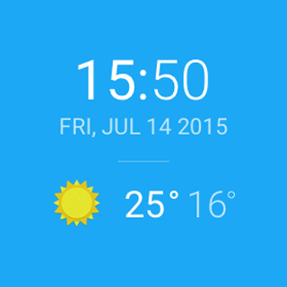

# Android Nanodegree Project 6 – Go Ubiquitous

Objective: build a watch face for Android Wear so users can access Sunshine's weather information at a glance.

## Usage
1. Download or clone the project and open it with Android Studio.
2. Add a file called `gradle.properties` to the root of the project.
3. In that file, add `MyOpenWeatherMapApiKey="YOUR_API_KEY"`. You can get your own API key from openweathermap.org.
4. Sync gradle and you're all set!

## What Have I Done?

I have learnt following things:

* Understand the fundamentals of Android Wear.
* Design for multiple watch form factors.
* Communicate between a mobile device and a wearable device.

